# 🏗️ BREKEKE PHONE - ARCHITECTURE FLOW DOCUMENTATION

**Project:** Brekeke Phone White-label Solution  
**Version:** 2.16.11  
**Date:** April 2, 2026  
**Purpose:** Documentation cho giai đoạn sales và implementation planning

---

## 📋 MỤC LỤC

1. [Tổng quan](#tổng-quan)
2. [Vai trò & Actors](#vai-trò--actors)
3. [Flow 1: Architecture hiện tại (Original Brekeke Phone)](#flow-1-architecture-hiện-tại)
4. [Flow 2: Architecture White-label (With Middleware)](#flow-2-architecture-white-label)
5. [So sánh Flow 1 vs Flow 2](#so-sánh-flow-1-vs-flow-2)
6. [Implementation Checklist](#implementation-checklist)
7. [Estimates & Timeline](#estimates--timeline)

---

## 🎯 TỔNG QUAN

### Mục tiêu White-label Solution

**Khách hàng đã mua license Brekeke** → Muốn tạo app với **thương hiệu riêng** (logo, màu sắc) và **trải nghiệm đơn giản** (chỉ nhập username/password)

### Key Requirements

- ✅ Ẩn thông tin technical: hostname, port, tenant
- ✅ Đổi logo, màu sắc thành thương hiệu riêng
- ✅ App độc lập trên iOS/Android store với tên công ty
- ✅ Giữ nguyên backend license (không ảnh hưởng Brekeke server)
- ✅ Push notification hoạt động với app ID mới

### Tech Stack

**Frontend (React Native):**
- React Native 0.80.1
- TypeScript
- MobX state management
- Cross-platform: iOS, Android, Web

**Middleware (NEW):**
- Node.js + Express/NestJS
- WebSocket proxy (`ws` library)
- Environment-based configuration

**Backend (Unchanged):**
- Brekeke PBX Server (Licensed)
- PAL (Phone Application Link)
- SIP WebRTC
- UC (Unified Communications)

**Branding Infrastructure (NEW):**
- CDN/Config Server cho logo và assets
- Dynamic branding configuration
- Logo caching mechanism

---

## 🎨 MULTI-TENANT BRANDING ARCHITECTURE

### Tổng quan

**SINGLE APP + DYNAMIC BRANDING** approach:
- ✅ Một app duy nhất trên App Store/Play Store
- ✅ Logo generic trên store và home screen
- ✅ Logo tenant-specific hiển thị INSIDE app sau khi login
- ✅ Fetch logo và branding config từ CDN/Config Server
- ✅ Cache logo locally để tránh load lại mỗi lần

### So sánh Multi-app vs Single-app Approach

| Aspect | Multi-app (One app per tenant) | Single-app (Dynamic branding) ✅ |
|--------|-------------------------------|----------------------------------|
| **App Store listings** | Nhiều listings (1 per tenant) | 1 listing duy nhất |
| **Maintenance** | Phức tạp (nhiều codebases) | Đơn giản (1 codebase) |
| **Time to add tenant** | 10-15 days | 2-4 hours |
| **Store icon** | Tenant-specific logo | Generic logo |
| **In-app logo** | Tenant-specific logo | Tenant-specific logo ✅ |
| **Branding** | Compile-time | Runtime ✅ |
| **Updates** | Deploy to all apps | Deploy once |

### Architecture Flow

```
┌─────────────────────────────────────────────────────────────┐
│                    USER LOGIN                               │
└─────────────────────────────────────────────────────────────┘
                           │
                           ▼
┌─────────────────────────────────────────────────────────────┐
│              MIDDLEWARE AUTHENTICATION                      │
│   - Nhận username/password                                  │
│   - Identify tenant từ username hoặc domain mapping        │
│   - Authenticate với Brekeke PBX                           │
└─────────────────────────────────────────────────────────────┘
                           │
                           ▼
┌─────────────────────────────────────────────────────────────┐
│            RETURN AUTH + BRANDING CONFIG                    │
│   {                                                         │
│     "authToken": "...",                                     │
│     "tenant": "bap-corp",                                   │
│     "branding": {                                           │
│       "logoUrl": "https://cdn.../bap-logo.png",           │
│       "primaryColor": "#1E40AF",                           │
│       "secondaryColor": "#3B82F6",                         │
│       "companyName": "BAP Corporation"                     │
│     }                                                       │
│   }                                                         │
└─────────────────────────────────────────────────────────────┘
                           │
                           ▼
┌─────────────────────────────────────────────────────────────┐
│              APP FETCH & CACHE LOGO                         │
│   1. Download logo từ logoUrl                              │
│   2. Cache vào AsyncStorage/FileSystem                     │
│   3. Apply primaryColor/secondaryColor                     │
│   4. Update UI với tenant branding                         │
└─────────────────────────────────────────────────────────────┘
                           │
                           ▼
┌─────────────────────────────────────────────────────────────┐
│          DISPLAY TENANT-SPECIFIC INTERFACE                  │
│   - Header: BAP Corporation logo                           │
│   - Colors: Blue theme (#1E40AF)                           │
│   - All subsequent screens show BAP branding               │
└─────────────────────────────────────────────────────────────┘
```

### Branding Config Format

**File: `config/tenants/bap-corp.json`**
```json
{
  "tenantId": "bap-corp",
  "companyName": "BAP Corporation",
  "branding": {
    "logo": {
      "url": "https://cdn.yourservice.com/logos/bap-corp.png",
      "width": 200,
      "height": 60
    },
    "colors": {
      "primary": "#1E40AF",
      "secondary": "#3B82F6",
      "accent": "#60A5FA",
      "background": "#F8FAFC",
      "text": "#1E293B"
    },
    "theme": "light",
    "fonts": {
      "primary": "Roboto",
      "heading": "Roboto-Bold"
    }
  },
  "pbxConfig": {
    "hostname": "pbx.bap-company.com",
    "port": 5060,
    "tenant": "bap-tenant"
  }
}
```

### Technical Implementation Flow

**High-level components:**

1. **App Layer:**
   - Check local cache for logo (AsyncStorage/FileSystem)
   - If cached → Display immediately
   - If not cached → Download from CDN URL → Cache locally
   - Apply dynamic colors to UI theme

2. **Middleware Layer:**
   - Identify tenant from username
   - Load tenant config (JSON file)
   - Return branding config with auth response:
     ```json
     {
       "authToken": "...",
       "tenant": "bap-corp",
       "branding": {
         "logoUrl": "https://cdn.../bap-logo.png",
         "primaryColor": "#1E40AF",
         "companyName": "BAP Corporation"
       }
     }
     ```

3. **CDN/Config Layer:**
   - Store logo files (bap-corp-logo.png, xyz-company-logo.png)
   - Store tenant config files (bap-corp.json, xyz-company.json)

### Tenant Addition Timeline

**Adding a new tenant (e.g., XYZ Company):**

| Task | Time | Description |
|------|------|-------------|
| 1. Create config JSON | 30 min | Create `xyz-company.json` config |
| 2. Upload logo to CDN | 15 min | Upload logo, get CDN URL |
| 3. Test login flow | 1 hour | Test with XYZ credentials |
| 4. Deploy middleware | 30 min | Deploy updated config |
| **TOTAL** | **2-3 hours** | VS 10-15 days for multi-app |

### Advantages

✅ **Fast tenant onboarding**: 2-3 hours instead of 10-15 days  
✅ **Single codebase**: Easier maintenance and updates  
✅ **Single app store listing**: No need for multiple developer accounts  
✅ **Flexible branding**: Change logos/colors without recompiling  
✅ **Easy updates**: Deploy once for all tenants  

### Trade-offs

⚠️ **Generic store icon**: App icon on store is generic, not tenant-specific  
⚠️ **Runtime overhead**: Logo download on first login (but cached afterwards)  
⚠️ **CDN dependency**: Requires CDN for hosting logos  

---

## 🎭 VAI TRÒ & ACTORS

### Các bên liên quan

#### 1️⃣ **BREKEKE (Vendor/Provider)**
- Cung cấp phần mềm Brekeke PBX + license
- Phát triển & maintain Brekeke Phone app (official)
- Public app trên App Store/Play Store
- Cung cấp support & documentation

#### 2️⃣ **KHÁCH HÀNG (Company - License Owner)**
**Ví dụ: BAP Corporation**
- Đã mua license Brekeke PBX
- Setup & vận hành Brekeke server riêng
- Có thông tin server:
  - Hostname: `pbx.bap-company.com`
  - Port: `5060`
  - Tenant: `bap-tenant`
- Quản lý danh sách nhân viên (end-users) trong PBX
- Cấp account cho từng nhân viên

#### 3️⃣ **END-USERS (Nhân viên của khách hàng)**
**Ví dụ: linh , Jane Smith, Bob Wilson**
- Là nhân viên của BAP Corporation
- Nhận thông tin từ IT admin công ty
- Download Brekeke Phone app từ store
- Tạo account với thông tin được cung cấp
- Sử dụng app để gọi điện, nhắn tin

---

### Flow từ mua license đến sử dụng (Mermaid)

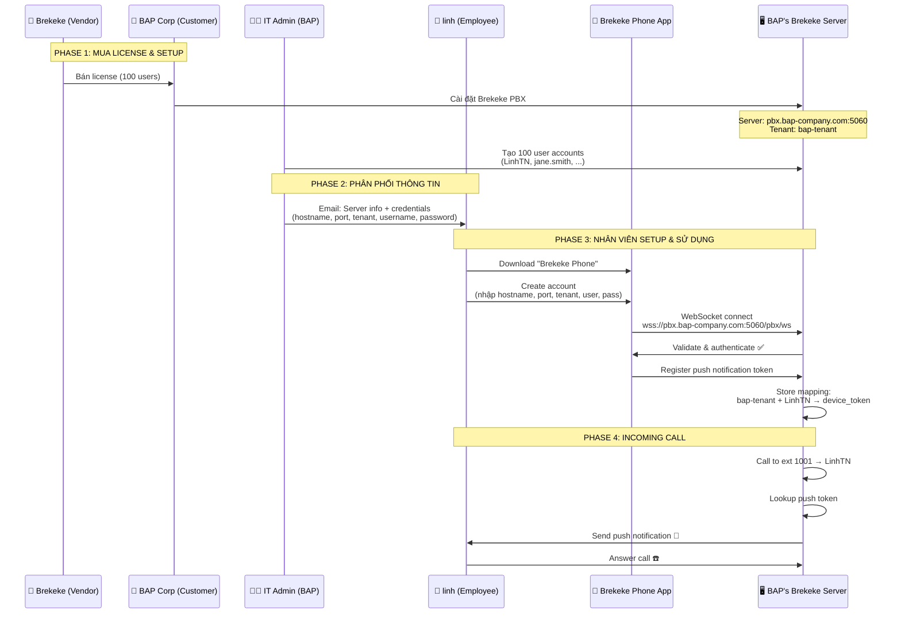
```mermaid
sequenceDiagram
    participant Brekeke as 🏢 Brekeke (Vendor)
    participant BAP as 🏢 BAP Corp (Customer)
    participant ITAdmin as 👨‍💼 IT Admin (BAP)
    participant linh as 👤 linh  (Employee)
    participant BrekekeApp as 📱 Brekeke Phone App
    participant BAPServer as 🖥️ BAP's Brekeke Server

    Note over Brekeke,BAP: PHASE 1: MUA LICENSE & SETUP
    Brekeke->>BAP: Bán license (100 users)
    BAP->>BAPServer: Cài đặt Brekeke PBX
    Note over BAPServer: Server: pbx.bap-company.com:5060<br/>Tenant: bap-tenant
    ITAdmin->>BAPServer: Tạo 100 user accounts<br/>(LinhTN, jane.smith, ...)

    Note over ITAdmin,linh: PHASE 2: PHÂN PHỐI THÔNG TIN
    ITAdmin->>linh: Email: Server info + credentials<br/>(hostname, port, tenant, username, password)

    Note over linh,BAPServer: PHASE 3: NHÂN VIÊN SETUP & SỬ DỤNG
    linh->>BrekekeApp: Download "Brekeke Phone"
    linh->>BrekekeApp: Create account<br/>(nhập hostname, port, tenant, user, pass)
    BrekekeApp->>BAPServer: WebSocket connect<br/>wss://pbx.bap-company.com:5060/pbx/ws
    BAPServer->>BrekekeApp: Validate & authenticate ✅
    BrekekeApp->>BAPServer: Register push notification token
    BAPServer->>BAPServer: Store mapping:<br/>bap-tenant + LinhTN → device_token

    Note over linh,BAPServer: PHASE 4: INCOMING CALL
    BAPServer->>BAPServer: Call to ext 1001 → LinhTN
    BAPServer->>BAPServer: Lookup push token
    BAPServer->>linh: Send push notification 🔔
    linh->>BAPServer: Answer call ☎️
```

---

### Push Notification Routing Mechanism

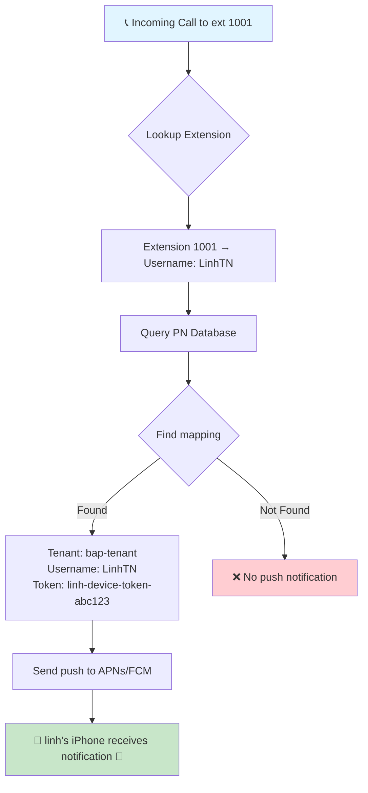
```mermaid
flowchart TD
    A[📞 Incoming Call to ext 1001] --> B{Lookup Extension}
    B --> C[Extension 1001 → Username: LinhTN]
    C --> D[Query PN Database]
    D --> E{Find mapping}
    E -->|Found| F[Tenant: bap-tenant<br/>Username: LinhTN<br/>Token: linh-device-token-abc123]
    E -->|Not Found| G[❌ No push notification]
    F --> H[Send push to APNs/FCM]
    H --> I[📱 linh's iPhone receives notification 🔔]
    
    style A fill:#e1f5ff
    style I fill:#c8e6c9
    style G fill:#ffcdd2
```

---

## 📊 FLOW 1: ARCHITECTURE HIỆN TẠI

### A. User Registration & Login Flow

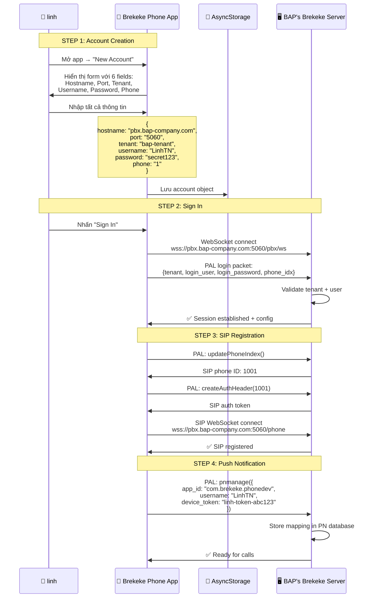
```mermaid
sequenceDiagram
    participant User as 👤 linh 
    participant App as 📱 Brekeke Phone App
    participant Storage as 💾 AsyncStorage
    participant Server as 🖥️ BAP's Brekeke Server

    Note over User,App: STEP 1: Account Creation
    User->>App: Mở app → "New Account"
    App->>User: Hiển thị form với 6 fields:<br/>Hostname, Port, Tenant,<br/>Username, Password, Phone
    User->>App: Nhập tất cả thông tin
    Note over App: {<br/>  hostname: "pbx.bap-company.com",<br/>  port: "5060",<br/>  tenant: "bap-tenant",<br/>  username: "LinhTN",<br/>  password: "secret123",<br/>  phone: "1"<br/>}
    App->>Storage: Lưu account object
    
    Note over User,Server: STEP 2: Sign In
    User->>App: Nhấn "Sign In"
    App->>Server: WebSocket connect<br/>wss://pbx.bap-company.com:5060/pbx/ws
    App->>Server: PAL login packet:<br/>{tenant, login_user, login_password, phone_idx}
    Server->>Server: Validate tenant + user
    Server->>App: ✅ Session established + config
    
    Note over App,Server: STEP 3: SIP Registration
    App->>Server: PAL: updatePhoneIndex()
    Server->>App: SIP phone ID: 1001
    App->>Server: PAL: createAuthHeader(1001)
    Server->>App: SIP auth token
    App->>Server: SIP WebSocket connect<br/>wss://pbx.bap-company.com:5060/phone
    Server->>App: ✅ SIP registered
    
    Note over App,Server: STEP 4: Push Notification
    App->>Server: PAL: pnmanage({<br/>  app_id: "com.brekeke.phonedev",<br/>  username: "LinhTN",<br/>  device_token: "linh-token-abc123"<br/>})
    Server->>Server: Store mapping in PN database
    Server->>App: ✅ Ready for calls
```

---

### B. Authentication Flow - Detailed

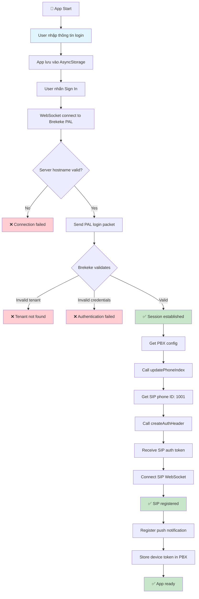
```mermaid
flowchart TD
    Start[📱 App Start] --> A1[User nhập thông tin login]
    A1 --> A2[App lưu vào AsyncStorage]
    A2 --> A3[User nhấn Sign In]
    
    A3 --> B1[WebSocket connect to Brekeke PAL]
    B1 --> B2{Server hostname valid?}
    B2 -->|No| B3[❌ Connection failed]
    B2 -->|Yes| B4[Send PAL login packet]
    
    B4 --> C1{Brekeke validates}
    C1 -->|Invalid tenant| C2[❌ Tenant not found]
    C1 -->|Invalid credentials| C3[❌ Authentication failed]
    C1 -->|Valid| C4[✅ Session established]
    
    C4 --> D1[Get PBX config]
    D1 --> D2[Call updatePhoneIndex]
    D2 --> D3[Get SIP phone ID: 1001]
    
    D3 --> E1[Call createAuthHeader]
    E1 --> E2[Receive SIP auth token]
    E2 --> E3[Connect SIP WebSocket]
    E3 --> E4[✅ SIP registered]
    
    E4 --> F1[Register push notification]
    F1 --> F2[Store device token in PBX]
    F2 --> F3[✅ App ready]
    
    style A1 fill:#e1f5ff
    style C4 fill:#c8e6c9
    style E4 fill:#c8e6c9
    style F3 fill:#c8e6c9
    style B3 fill:#ffcdd2
    style C2 fill:#ffcdd2
    style C3 fill:#ffcdd2
```

---

### C. Real-world Scenario - BAP Corporation

**Scenario chi tiết:**

1. **BAP Corp mua license & setup**
   - 100 nhân viên
   - Server: `pbx.bap-company.com:5060`
   - Tenant: `bap-tenant`

2. **IT Admin tạo users:**

| Username | Password | Extension | Phone |
|----------|----------|-----------|-------|
| LinhTN | linh123 | 1001 | 1 |
| jane.smith | jane456 | 1002 | 1 |
| bob.wilson | bob789 | 1003 | 1 |
| ... | ... | ... | ... |

3. **IT Admin gửi email cho nhân viên:**

```
To: all-employees@bap-company.com
Subject: Setup Brekeke Phone App

Dear Team,

Please download "Brekeke Phone" and use:
- Hostname: pbx.bap-company.com
- Port: 5060
- Tenant: bap-tenant
- Username: [your username]
- Password: [your password]
- Phone: 1
```

4. **linh  setup app:**

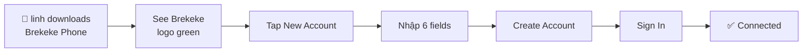
```mermaid
flowchart LR
    A[📱 linh downloads<br/>Brekeke Phone] --> B[See Brekeke<br/>logo green]
    B --> C[Tap New Account]
    C --> D[Nhập 6 fields]
    D --> E[Create Account]
    E --> F[Sign In]
    F --> G[✅ Connected]
```

5. **Incoming call flow:**

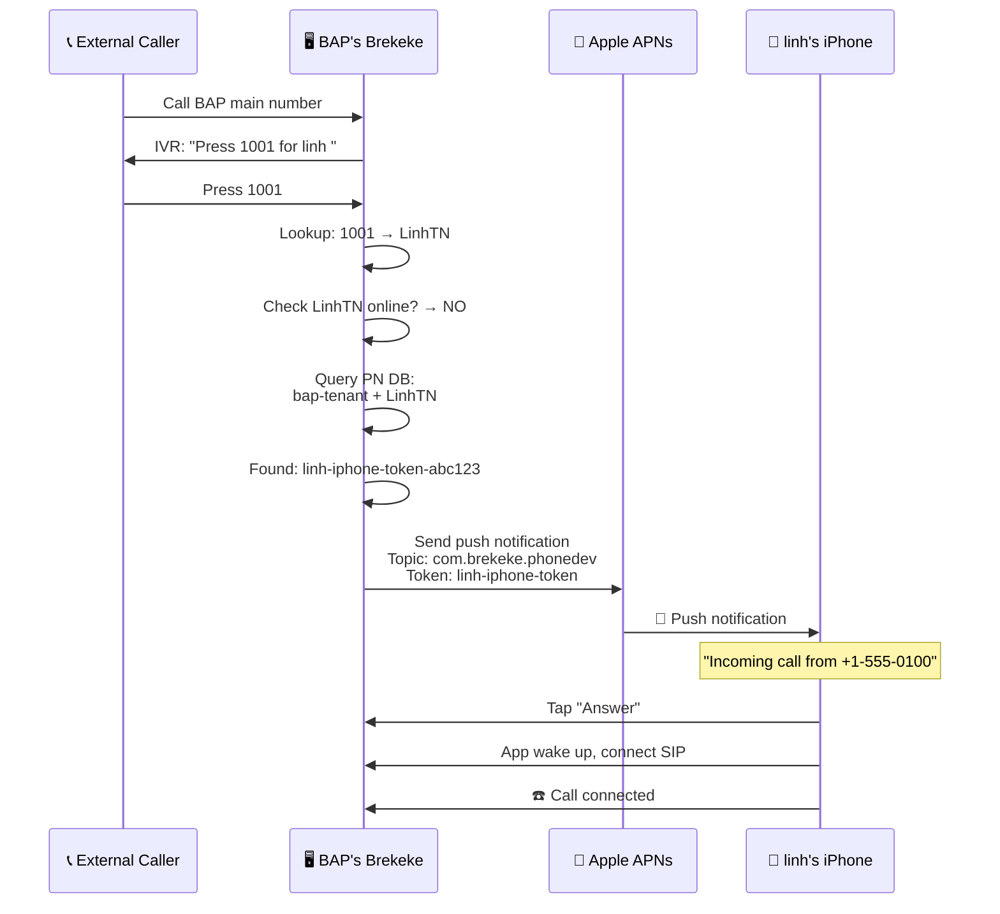
```mermaid
sequenceDiagram
    participant Caller as 📞 External Caller
    participant PBX as 🖥️ BAP's Brekeke
    participant APNS as 🍎 Apple APNs
    participant linh as 📱 linh's iPhone

    Caller->>PBX: Call BAP main number
    PBX->>Caller: IVR: "Press 1001 for linh "
    Caller->>PBX: Press 1001
    PBX->>PBX: Lookup: 1001 → LinhTN
    PBX->>PBX: Check LinhTN online? → NO
    PBX->>PBX: Query PN DB:<br/>bap-tenant + LinhTN
    PBX->>PBX: Found: linh-iphone-token-abc123
    PBX->>APNS: Send push notification<br/>Topic: com.brekeke.phonedev<br/>Token: linh-iphone-token
    APNS->>linh: 🔔 Push notification
    Note over linh: "Incoming call from +1-555-0100"
    linh->>PBX: Tap "Answer"
    linh->>PBX: App wake up, connect SIP
    linh->>PBX: ☎️ Call connected
```

---

### D. Multiple Users Scenario

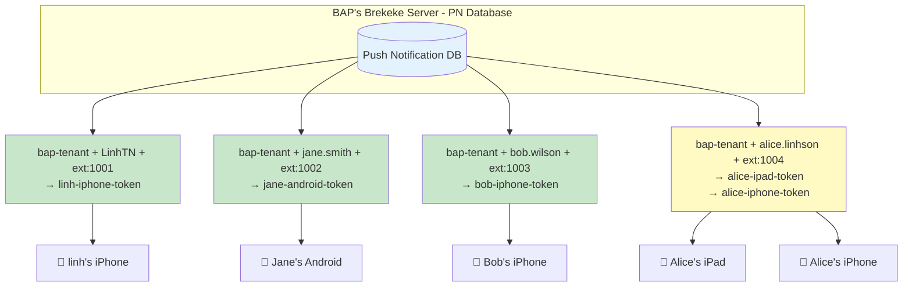
```mermaid
graph TB
    subgraph "BAP's Brekeke Server - PN Database"
        DB[(Push Notification DB)]
    end
    
    DB --> U1[bap-tenant + LinhTN + ext:1001<br/>→ linh-iphone-token]
    DB --> U2[bap-tenant + jane.smith + ext:1002<br/>→ jane-android-token]
    DB --> U3[bap-tenant + bob.wilson + ext:1003<br/>→ bob-iphone-token]
    DB --> U4[bap-tenant + alice.linhson + ext:1004<br/>→ alice-ipad-token<br/>→ alice-iphone-token]
    
    U1 --> D1[📱 linh's iPhone]
    U2 --> D2[📱 Jane's Android]
    U3 --> D3[📱 Bob's iPhone]
    U4 --> D4[📱 Alice's iPad]
    U4 --> D5[📱 Alice's iPhone]
    
    style DB fill:#e3f2fd
    style U1 fill:#c8e6c9
    style U2 fill:#c8e6c9
    style U3 fill:#c8e6c9
    style U4 fill:#fff9c4
```

**Scenarios:**

| Scenario | Target | Result |
|----------|--------|--------|
| Call to ext 1002 | jane.smith | ONLY Jane's Android rings 🔔 |
| linh calls Bob (1001→1003) | bob.wilson | ONLY Bob's iPhone rings 🔔 |
| Call to ext 1004 (Alice) | alice.linhson | BOTH Alice's iPad & iPhone ring 🔔🔔 |
| Broadcast to all 100 users | All | 100 devices ring 🔔 (100 push sent) |

---

### E. Pain Points của Flow hiện tại

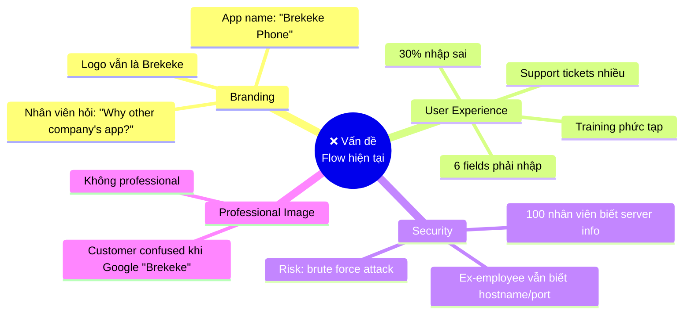
```mermaid
mindmap
  root((❌ Vấn đề<br/>Flow hiện tại))
    Branding
      Logo vẫn là Brekeke
      App name: "Brekeke Phone"
      Nhân viên hỏi: "Why other company's app?"
    User Experience
      6 fields phải nhập
      30% nhập sai
      Support tickets nhiều
      Training phức tạp
    Security
      100 nhân viên biết server info
      Ex-employee vẫn biết hostname/port
      Risk: brute force attack
    Professional Image
      Customer confused khi Google "Brekeke"
      Không professional
```

---

## 📊 FLOW 2: ARCHITECTURE WHITE-LABEL

### A. Simplified Login Flow (With Middleware)

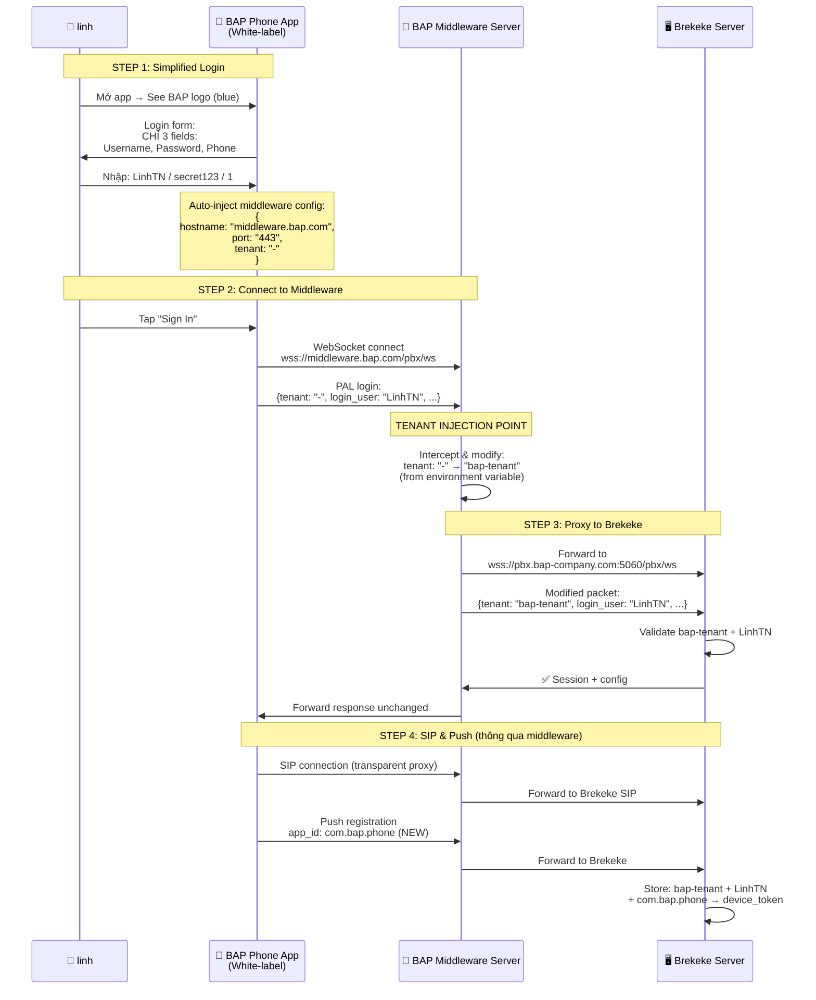
```mermaid
sequenceDiagram
    participant User as 👤 linh 
    participant App as 📱 BAP Phone App<br/>(White-label)
    participant Middleware as 🔀 BAP Middleware Server
    participant Brekeke as 🖥️ Brekeke Server

    Note over User,App: STEP 1: Simplified Login
    User->>App: Mở app → See BAP logo (blue)
    App->>User: Login form:<br/>CHỈ 3 fields:<br/>Username, Password, Phone
    User->>App: Nhập: LinhTN / secret123 / 1
    
    Note over App: Auto-inject middleware config:<br/>{<br/>  hostname: "middleware.bap.com",<br/>  port: "443",<br/>  tenant: "-"<br/>}
    
    Note over User,Middleware: STEP 2: Connect to Middleware
    User->>App: Tap "Sign In"
    App->>Middleware: WebSocket connect<br/>wss://middleware.bap.com/pbx/ws
    App->>Middleware: PAL login:<br/>{tenant: "-", login_user: "LinhTN", ...}
    
    Note over Middleware: TENANT INJECTION POINT
    Middleware->>Middleware: Intercept & modify:<br/>tenant: "-" → "bap-tenant"<br/>(from environment variable)
    
    Note over Middleware,Brekeke: STEP 3: Proxy to Brekeke
    Middleware->>Brekeke: Forward to<br/>wss://pbx.bap-company.com:5060/pbx/ws
    Middleware->>Brekeke: Modified packet:<br/>{tenant: "bap-tenant", login_user: "LinhTN", ...}
    Brekeke->>Brekeke: Validate bap-tenant + LinhTN
    Brekeke->>Middleware: ✅ Session + config
    Middleware->>App: Forward response unchanged
    
    Note over App,Brekeke: STEP 4: SIP & Push (thông qua middleware)
    App->>Middleware: SIP connection (transparent proxy)
    Middleware->>Brekeke: Forward to Brekeke SIP
    App->>Middleware: Push registration<br/>app_id: com.bap.phone (NEW)
    Middleware->>Brekeke: Forward to Brekeke
    Brekeke->>Brekeke: Store: bap-tenant + LinhTN<br/>+ com.bap.phone → device_token
```

---

### B. Middleware Architecture

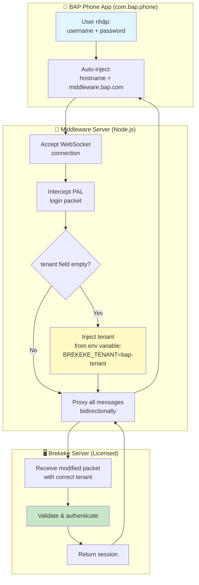
```mermaid
flowchart TB
    subgraph "📱 BAP Phone App (com.bap.phone)"
        A1[User nhập:<br/>username + password]
        A2[Auto-inject:<br/>hostname = middleware.bap.com]
    end
    
    A1 --> A2
    A2 --> M1
    
    subgraph "🔀 Middleware Server (Node.js)"
        M1[Accept WebSocket<br/>connection]
        M2[Intercept PAL<br/>login packet]
        M3{tenant field empty?}
        M4[Inject tenant<br/>from env variable:<br/>BREKEKE_TENANT=bap-tenant]
        M5[Proxy all messages<br/>bidirectionally]
        
        M1 --> M2
        M2 --> M3
        M3 -->|Yes| M4
        M3 -->|No| M5
        M4 --> M5
    end
    
    M5 --> B1
    
    subgraph "🖥️ Brekeke Server (Licensed)"
        B1[Receive modified packet<br/>with correct tenant]
        B2[Validate & authenticate]
        B3[Return session]
    end
    
    B1 --> B2
    B2 --> B3
    B3 --> M5
    M5 --> A2
    
    style A1 fill:#e1f5ff
    style M4 fill:#fff9c4
    style B2 fill:#c8e6c9
```

---

### C. Push Notification với App ID mới

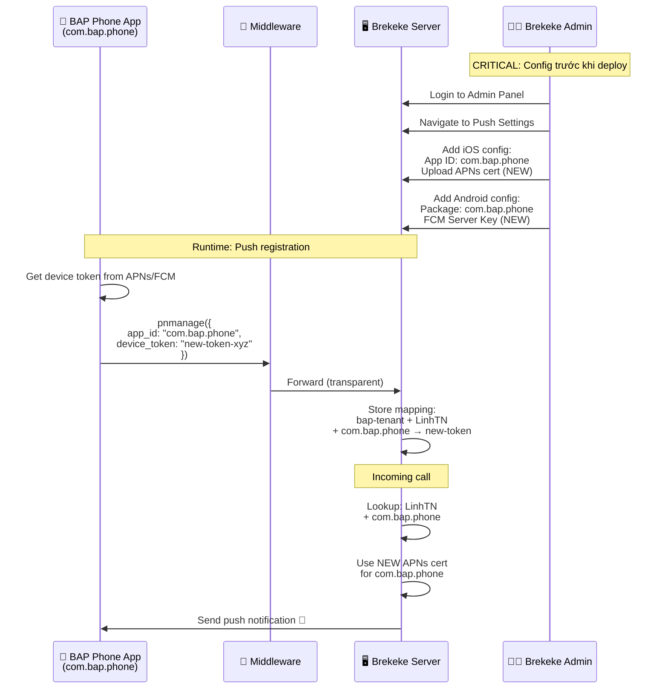
```mermaid
sequenceDiagram
    participant App as 📱 BAP Phone App<br/>(com.bap.phone)
    participant Middleware as 🔀 Middleware
    participant Brekeke as 🖥️ Brekeke Server
    participant Admin as 👨‍💼 Brekeke Admin

    Note over Admin: CRITICAL: Config trước khi deploy
    Admin->>Brekeke: Login to Admin Panel
    Admin->>Brekeke: Navigate to Push Settings
    Admin->>Brekeke: Add iOS config:<br/>App ID: com.bap.phone<br/>Upload APNs cert (NEW)
    Admin->>Brekeke: Add Android config:<br/>Package: com.bap.phone<br/>FCM Server Key (NEW)
    
    Note over App,Brekeke: Runtime: Push registration
    App->>App: Get device token from APNs/FCM
    App->>Middleware: pnmanage({<br/>  app_id: "com.bap.phone",<br/>  device_token: "new-token-xyz"<br/>})
    Middleware->>Brekeke: Forward (transparent)
    Brekeke->>Brekeke: Store mapping:<br/>bap-tenant + LinhTN<br/>+ com.bap.phone → new-token
    
    Note over Brekeke: Incoming call
    Brekeke->>Brekeke: Lookup: LinhTN<br/>+ com.bap.phone
    Brekeke->>Brekeke: Use NEW APNs cert<br/>for com.bap.phone
    Brekeke->>App: Send push notification 🔔
```

---

### D. Complete White-label Architecture

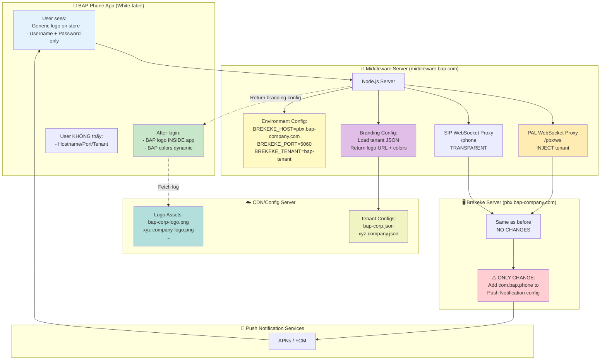
```mermaid
graph TB
    subgraph "📱 BAP Phone App (White-label)"
        U1[User sees:<br/>- Generic logo on store<br/>- Username + Password only]
        U2[After login:<br/>- BAP logo INSIDE app<br/>- BAP colors dynamic]
        U3[User KHÔNG thấy:<br/>- Hostname/Port/Tenant]
    end
    
    U1 --> MW
    
    subgraph "🔀 Middleware Server (middleware.bap.com)"
        MW[Node.js Server]
        ENV[Environment Config:<br/>BREKEKE_HOST=pbx.bap-company.com<br/>BREKEKE_PORT=5060<br/>BREKEKE_TENANT=bap-tenant]
        BRAND[Branding Config:<br/>Load tenant JSON<br/>Return logo URL + colors]
        PAL[PAL WebSocket Proxy<br/>/pbx/ws<br/>INJECT tenant]
        SIP[SIP WebSocket Proxy<br/>/phone<br/>TRANSPARENT]
        
        MW --> ENV
        MW --> BRAND
        MW --> PAL
        MW --> SIP
    end
    
    subgraph "☁️ CDN/Config Server"
        CDN[Logo Assets:<br/>bap-corp-logo.png<br/>xyz-company-logo.png<br/>...]
        CONFIG[Tenant Configs:<br/>bap-corp.json<br/>xyz-company.json]
    end
    
    BRAND --> CONFIG
    
    PAL --> BS
    SIP --> BS
    
    subgraph "🖥️ Brekeke Server (pbx.bap-company.com)"
        BS[Same as before<br/>NO CHANGES]
        PNCONF[⚠️ ONLY CHANGE:<br/>Add com.bap.phone to<br/>Push Notification config]
        
        BS --> PNCONF
    end
    
    PNCONF --> PUSH
    
    subgraph "🍎 Push Notification Services"
        PUSH[APNs / FCM]
    end
    
    PUSH --> U1
    
    MW -.Return branding config.-> U2
    U2 -.Fetch logo.-> CDN
    
    style U1 fill:#e3f2fd
    style U2 fill:#c8e6c9
    style ENV fill:#fff9c4
    style BRAND fill:#e1bee7
    style PAL fill:#ffecb3
    style PNCONF fill:#ffcdd2
    style CDN fill:#b2dfdb
    style CONFIG fill:#f0f4c3
```

---

### E. Tenant Addition Workflow (Config-based)

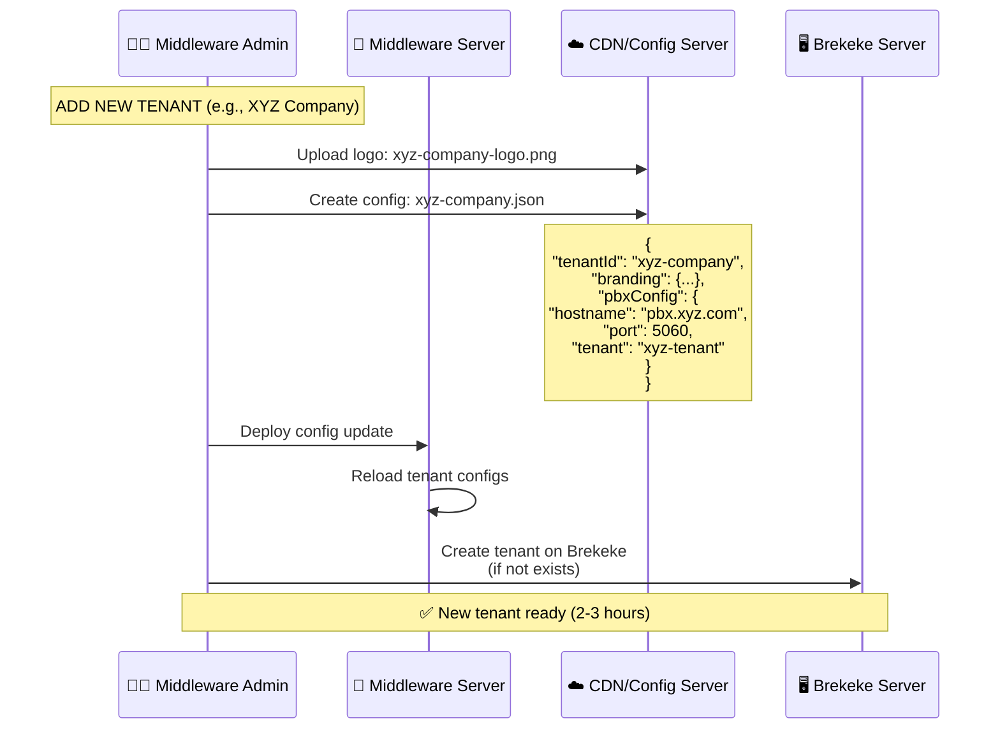
```mermaid
sequenceDiagram
    participant Admin as 👨‍💼 Middleware Admin
    participant Middleware as 🔀 Middleware Server
    participant CDN as ☁️ CDN/Config Server
    participant Brekeke as 🖥️ Brekeke Server

    Note over Admin: ADD NEW TENANT (e.g., XYZ Company)
    Admin->>CDN: Upload logo: xyz-company-logo.png
    Admin->>CDN: Create config: xyz-company.json
    Note over CDN: {<br/>  "tenantId": "xyz-company",<br/>  "branding": {...},<br/>  "pbxConfig": {<br/>    "hostname": "pbx.xyz.com",<br/>    "port": 5060,<br/>    "tenant": "xyz-tenant"<br/>  }<br/>}
    Admin->>Middleware: Deploy config update
    Middleware->>Middleware: Reload tenant configs
    Admin->>Brekeke: Create tenant on Brekeke<br/>(if not exists)
    Note over Admin,Brekeke: ✅ New tenant ready (2-3 hours)
```

---

### F. User Creation Flow (Script/Job trên Middleware)

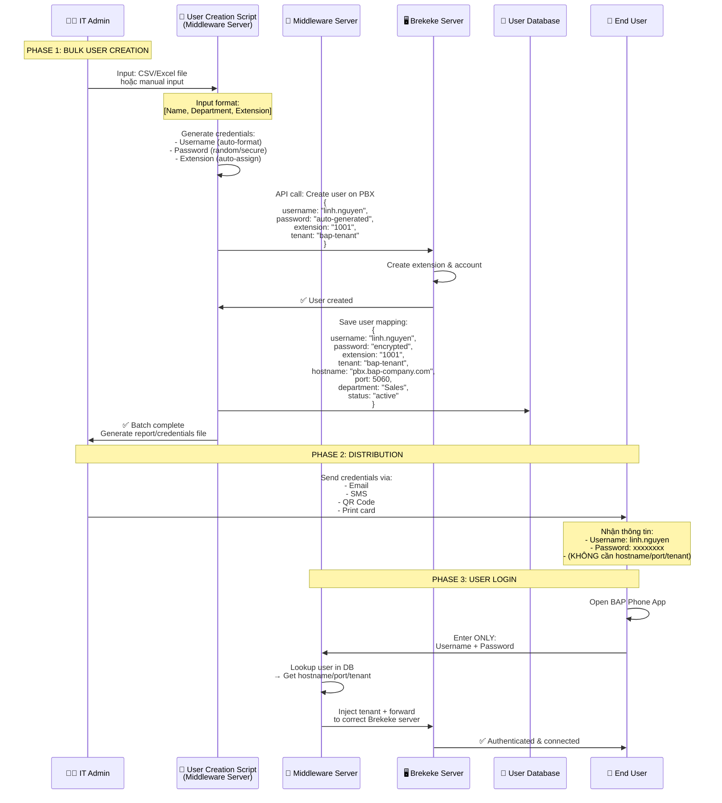
```mermaid
sequenceDiagram
    participant Admin as 👨‍💼 IT Admin
    participant Script as 📜 User Creation Script<br/>(Middleware Server)
    participant Middleware as 🔀 Middleware Server
    participant Brekeke as 🖥️ Brekeke Server
    participant Storage as 💾 User Database
    participant User as 👤 End User

    Note over Admin: PHASE 1: BULK USER CREATION
    Admin->>Script: Input: CSV/Excel file<br/>hoặc manual input
    Note over Script: Input format:<br/>[Name, Department, Extension]
    
    Script->>Script: Generate credentials:<br/>- Username (auto-format)<br/>- Password (random/secure)<br/>- Extension (auto-assign)
    
    Script->>Brekeke: API call: Create user on PBX<br/>{<br/>  username: "linh.nguyen",<br/>  password: "auto-generated",<br/>  extension: "1001",<br/>  tenant: "bap-tenant"<br/>}
    Brekeke->>Brekeke: Create extension & account
    Brekeke->>Script: ✅ User created
    
    Script->>Storage: Save user mapping:<br/>{<br/>  username: "linh.nguyen",<br/>  password: "encrypted",<br/>  extension: "1001",<br/>  tenant: "bap-tenant",<br/>  hostname: "pbx.bap-company.com",<br/>  port: 5060,<br/>  department: "Sales",<br/>  status: "active"<br/>}
    
    Script->>Admin: ✅ Batch complete<br/>Generate report/credentials file

    Note over Admin,User: PHASE 2: DISTRIBUTION
    Admin->>User: Send credentials via:<br/>- Email<br/>- SMS<br/>- QR Code<br/>- Print card
    Note over User: Nhận thông tin:<br/>- Username: linh.nguyen<br/>- Password: xxxxxxxx<br/>- (KHÔNG cần hostname/port/tenant)

    Note over User,Middleware: PHASE 3: USER LOGIN
    User->>User: Open BAP Phone App
    User->>Middleware: Enter ONLY:<br/>Username + Password
    Middleware->>Middleware: Lookup user in DB<br/>→ Get hostname/port/tenant
    Middleware->>Brekeke: Inject tenant + forward<br/>to correct Brekeke server
    Brekeke->>User: ✅ Authenticated & connected
```

---

### F.1. Script Architecture

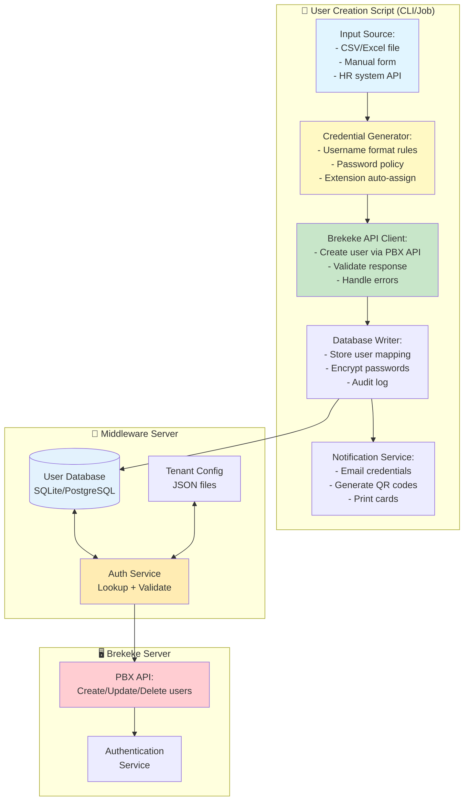
```mermaid
flowchart TB
    subgraph "📜 User Creation Script (CLI/Job)"
        S1[Input Source:<br/>- CSV/Excel file<br/>- Manual form<br/>- HR system API]
        S2[Credential Generator:<br/>- Username format rules<br/>- Password policy<br/>- Extension auto-assign]
        S3[Brekeke API Client:<br/>- Create user via PBX API<br/>- Validate response<br/>- Handle errors]
        S4[Database Writer:<br/>- Store user mapping<br/>- Encrypt passwords<br/>- Audit log]
        S5[Notification Service:<br/>- Email credentials<br/>- Generate QR codes<br/>- Print cards]
        
        S1 --> S2
        S2 --> S3
        S3 --> S4
        S4 --> S5
    end
    
    subgraph "🔀 Middleware Server"
        M1[(User Database<br/>SQLite/PostgreSQL)]
        M2[Tenant Config<br/>JSON files]
        M3[Auth Service<br/>Lookup + Validate]
        
        M1 <--> M3
        M2 <--> M3
    end
    
    S4 --> M1
    M3 --> B1
    
    subgraph "🖥️ Brekeke Server"
        B1[PBX API:<br/>Create/Update/Delete users]
        B2[Authentication<br/>Service]
    end
    
    B1 --> B2
    
    style S1 fill:#e1f5ff
    style S2 fill:#fff9c4
    style S3 fill:#c8e6c9
    style M1 fill:#e3f2fd
    style M3 fill:#ffecb3
    style B1 fill:#ffcdd2
```

---

### F.2. User Database Schema

```json
{
  "users": [
    {
      "id": "usr_001",
      "username": "linh.nguyen",
      "password": "$2b$10$encrypted...",
      "extension": "1001",
      "tenant": "bap-tenant",
      "hostname": "pbx.bap-company.com",
      "port": 5060,
      "department": "Sales",
      "fullName": "Linh Nguyen",
      "email": "linh.nguyen@bap.com",
      "status": "active",
      "createdAt": "2026-04-03T10:00:00Z",
      "lastLogin": "2026-04-03T14:30:00Z",
      "deviceTokens": ["apns-token-abc", "fcm-token-xyz"]
    }
  ]
}
```

---

### F.3. Credential Generation Rules

| Rule | Format | Example |
|------|--------|---------|
| **Username** | `{firstname}.{lastname}` | `linh.nguyen` |
| **Username (alt)** | `{firstInitial}{lastname}` | `lnguyen` |
| **Username (alt)** | `{employeeId}` | `EMP001` |
| **Password** | Random 12 chars (secure) | `xK9#mP2$vL5n` |
| **Password (alt)** | `{CompanyPrefix}{random6}` | `BAP@847291` |
| **Extension** | Auto-increment from range | `1001`, `1002`, `1003` |

---

### F.4. Script Usage Examples

**CLI Command:**
```bash
# Create single user
npm run create-user \
  --name="Linh Nguyen" \
  --department="Sales" \
  --extension=1001

# Bulk create from CSV
npm run bulk-create \
  --file=./users-import.csv \
  --tenant=bap-tenant

# Generate credentials report
npm run generate-report \
  --format=pdf \
  --output=./credentials-bap.pdf

# Deactivate user
npm run deactivate-user \
  --username=linh.nguyen
```

**CSV Input Format:**
```csv
fullName,department,extension,email
Linh Nguyen,Sales,1001,linh.nguyen@bap.com
Jane Smith,Marketing,1002,jane.smith@bap.com
Bob Wilson,Support,1003,bob.wilson@bap.com
```

**Output Report:**
```csv
username,password,extension,fullName,department,status
linh.nguyen,xK9#mP2$vL5n,1001,Linh Nguyen,Sales,active
jane.smith,aB7!nQ4@wR8m,1002,Jane Smith,Marketing,active
bob.wilson,cD3#pT6$yU9k,1003,Bob Wilson,Support,active
```

---

### F.5. Security Considerations

| Aspect | Implementation |
|--------|----------------|
| **Password Storage** | bcrypt/scrypt encryption (never plain text) |
| **Password Policy** | Min 12 chars, mixed case, numbers, symbols |
| **CSV Handling** | Auto-delete after import, encrypted temp storage |
| **Audit Log** | Track all user creation/modification/deletion |
| **Access Control** | Script requires admin API key |
| **Rate Limiting** | Prevent brute force on script endpoints |
| **Data Retention** | Auto-purge inactive users after X days |

---

### F.6. Integration với Middleware Auth Flow

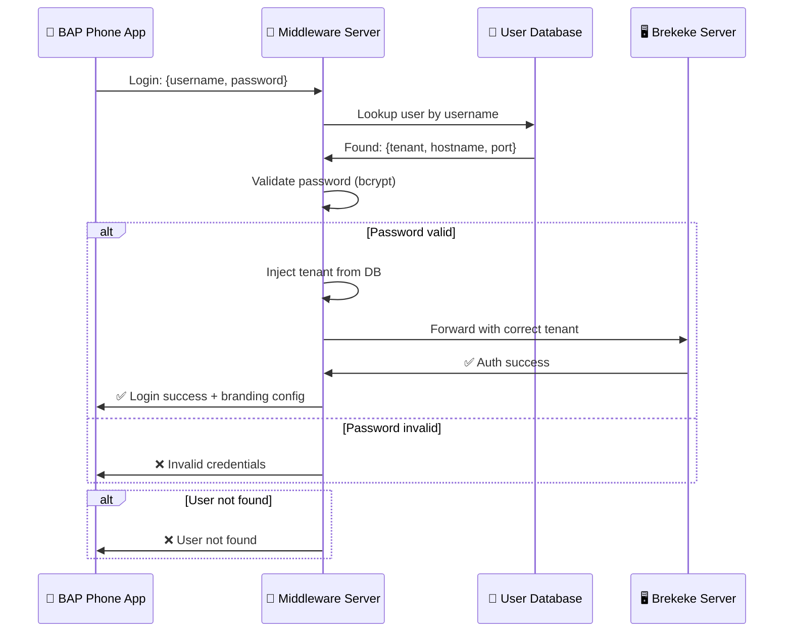
```mermaid
sequenceDiagram
    participant App as 📱 BAP Phone App
    participant Middleware as 🔀 Middleware Server
    participant UserDB as 💾 User Database
    participant Brekeke as 🖥️ Brekeke Server

    App->>Middleware: Login: {username, password}
    Middleware->>UserDB: Lookup user by username
    UserDB->>Middleware: Found: {tenant, hostname, port}
    Middleware->>Middleware: Validate password (bcrypt)
    
    alt Password valid
        Middleware->>Middleware: Inject tenant from DB
        Middleware->>Brekeke: Forward with correct tenant
        Brekeke->>Middleware: ✅ Auth success
        Middleware->>App: ✅ Login success + branding config
    else Password invalid
        Middleware->>App: ❌ Invalid credentials
    end
    
    alt User not found
        Middleware->>App: ❌ User not found
    end
```

---

## 🔄 SO SÁNH FLOW 1 VS FLOW 2

### Comparison Table

| Aspect | FLOW 1 (Hiện tại) | FLOW 2 (White-label) |
|--------|-------------------|----------------------|
| **User Input** | Hostname, Port, Tenant, Username, Password, Phone (6 fields) | Username, Password, Phone (3 fields) |
| **App Name** | "Brekeke Phone" | "BAP Phone" |
| **Store Logo** | Brekeke logo (green) | Generic logo |
| **In-app Logo** | Brekeke logo (green) | BAP logo (dynamic, loaded after login) |
| **Colors** | Brekeke colors (green) | BAP colors (dynamic, từ config) |
| **Bundle ID** | `com.brekeke.phonedev` | `com.bap.phone` (NEW) |
| **App connects to** | Brekeke server trực tiếp | Middleware server |
| **WebSocket URL** | `wss://pbx.bap-company.com:5060/pbx/ws` | `wss://middleware.bap.com/pbx/ws` |
| **Tenant info** | User nhập | Middleware inject tự động |
| **Branding** | Compile-time (hard-coded) | Runtime (dynamic from CDN) |
| **Security** | Nhân viên biết server info | Server info ẩn trong middleware |
| **Brekeke config** | Không thay đổi | Chỉ thêm Push Notification app ID + certs |
| **Push Certificate** | Brekeke's certificate | BAP's certificate (NEW) |
| **User experience** | Technical, phức tạp | Simplified, user-friendly |
| **Maintenance** | User tự quản lý server info | Admin quản lý centrally |
| **Add new tenant** | N/A (one company per app) | 2-3 hours (config + CDN upload) |

---

### Visual Comparison

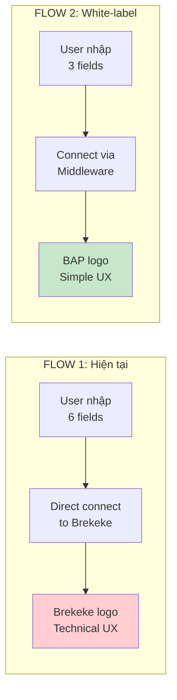
```mermaid
flowchart LR
    subgraph "FLOW 1: Hiện tại"
        F1A[User nhập<br/>6 fields] --> F1B[Direct connect<br/>to Brekeke]
        F1B --> F1C[Brekeke logo<br/>Technical UX]
    end
    
    subgraph "FLOW 2: White-label"
        F2A[User nhập<br/>3 fields] --> F2B[Connect via<br/>Middleware]
        F2B --> F2C[BAP logo<br/>Simple UX]
    end
    
    style F1C fill:#ffcdd2
    style F2C fill:#c8e6c9
```

---

## ✅ IMPLEMENTATION CHECKLIST

### Phase 1: Middleware Server Setup

**Infrastructure:**
- [ ] Setup Node.js server (Express/NestJS)
- [ ] Setup SSL certificate (Let's Encrypt)
- [ ] Configure environment variables:
  - `BREKEKE_HOST`, `BREKEKE_PORT`, `BREKEKE_TENANT`

**Development:**
- [ ] Implement PAL WebSocket proxy with tenant injection
- [ ] Implement SIP WebSocket transparent proxy
- [ ] Add logging & monitoring
- [ ] Add health check endpoint

**Testing:**
- [ ] Test PAL connection with wscat
- [ ] Verify tenant injection works
- [ ] Test SIP connection
- [ ] Load testing

**Deployment:**
- [ ] Deploy to production server
- [ ] Configure firewall
- [ ] Setup PM2 monitoring

**Estimate:** 19-30 giờ (2.5-4 ngày)

---

### Phase 2: React Native App Modification

**Configuration:**
- [ ] Create `src/config/middleware.ts`
- [ ] Create `src/config/branding.ts`

**UI Changes:**
- [ ] Modify `AccountCreateForm.tsx` - Remove hostname/port/tenant fields
- [ ] Modify `AccountSignInItem.tsx` - Remove technical display
- [ ] Update `variables.ts` - Change colors

**Logic Changes:**
- [ ] Modify `accountStore.ts` - Auto-inject middleware config
- [ ] Modify `pbx.ts` - Change WebSocket URL
- [ ] Modify `sip.ts` - Change WebSocket URL

**Branding Assets (Option 1: Quick - có sẵn assets):**
- [ ] Replace `src/assets/brand.png`, `logo.png`
- [ ] Replace iOS app icons (13 files)
- [ ] Replace iOS splash screens (3 files)
- [ ] Replace Android app icons (5 files)
- [ ] Replace Android splash screens (5 files)
- [ ] Replace `public/favicon.ico`

**Bundle ID Changes:**
- [ ] iOS: Update Bundle Identifier to `com.bap.phone`
- [ ] Android: Update Package Name to `com.bap.phone`

**Estimate:**
- Code changes: 10-15 giờ (1.5-2 ngày)
- Branding (có sẵn assets): 4-5 giờ (theo Estimate_ChangeColorAndLogo.md)
- Branding (cần export): 6-7 giờ

---

### Phase 3: Push Notification Setup

**iOS APNs:**
- [ ] Create App ID: `com.bap.phone`
- [ ] Generate APNs Certificate (.p12) or Key (.p8)
- [ ] Download certificate/key

**Android FCM:**
- [ ] Create Firebase project
- [ ] Add Android app: `com.bap.phone`
- [ ] Download `google-services.json`
- [ ] Get FCM Server Key

**Brekeke Configuration:**
- [ ] Login to Brekeke Admin Panel
- [ ] Add iOS config: `com.bap.phone` + APNs cert
- [ ] Add Android config: `com.bap.phone` + FCM key
- [ ] Test push notification

**Estimate:** 6-8 giờ (1 ngày)

---

### Phase 4: Testing

- [ ] Login with username/password only
- [ ] Verify middleware injection
- [ ] Test PBX connection
- [ ] Test SIP registration
- [ ] Make/receive calls
- [ ] Test push notifications (iOS + Android)
- [ ] Test all 33 screens

**Estimate:** 13-21 giờ (2-3 ngày)

---

### Phase 5: Deployment

- [ ] Build iOS (.ipa)
- [ ] Build Android (.apk/.aab)
- [ ] Prepare App Store screenshots
- [ ] Prepare Play Store screenshots
- [ ] Submit to stores
- [ ] Documentation

**Estimate:** 12-19 giờ (2-3 ngày)

---

## ⏱️ ESTIMATES & TIMELINE

### Development Time Estimates (Based on actual files)

#### **A. Change Logo & Colors Only**
(Based on `Estimate_ChangeColorAndLogo.md`)

**Option 1: Quick Update (có sẵn logo đủ sizes)**
```
✅ Đổi màu (sửa code + test):          1.2 giờ
✅ Đổi logo (replace files + test):    3.0 giờ
───────────────────────────────────────────────
TOTAL:                                 4.2 giờ
```
**Rounded:** **4-5 giờ** (nửa ngày)

**Option 2: Standard (cần export logo variants)**
```
✅ Đổi màu (full + fix hardcoded):     1.5 giờ
✅ Export logo variants:               1.0 giờ
✅ Đổi logo (replace + test):          3.0 giờ
✅ Full QA testing:                    1.0 giờ
───────────────────────────────────────────────
TOTAL:                                 6.5 giờ
```
**Rounded:** **6-7 giờ** (1 ngày)

---

#### **B. Custom UI Feature (Optional - nếu cần)**
(Based on `Estimate_CustomUI_Feature.md`)

**Standard Package (recommended):**
```
✅ Theme store (full) + Integration:   6 giờ
✅ Settings button + Custom UI page:   6.5 giờ
✅ Color picker + Preview:             5.5 giờ
✅ Full testing:                       9 giờ
✅ UX improvements + Code review:      5 giờ
───────────────────────────────────────────────
TOTAL:                                32 giờ
```
**With buffer (30%):** **42 giờ** (~5 ngày)

---

#### **C. White-label Implementation**

| Phase | Tasks | Hours | Days |
|-------|-------|-------|------|
| **Middleware Development** | Setup + PAL proxy + SIP proxy | 19-30h | 2.5-4 |
| **App Code Modification** | Config + UI + Logic changes | 10-15h | 1.5-2 |
| **Branding (Quick)** | Replace assets (có sẵn) | 4-5h | 0.5-1 |
| **Branding (Standard)** | Export + Replace (cần export) | 6-7h | 1 |
| **Push Notification** | Setup certs + Config Brekeke | 6-8h | 1 |
| **Testing** | Functional + Push + Cross-platform | 13-21h | 2-3 |
| **Deployment** | Build + Store submission | 12-19h | 2-3 |
| **TOTAL (Quick Branding)** | | **64-98h** | **8-12 days** |
| **TOTAL (Standard Branding)** | | **66-100h** | **8-13 days** |

---

### **RECOMMENDED ESTIMATE FOR SALES:**

#### **Package 1: Logo & Colors Only**
**Timeline:** 1 ngày  
**Effort:** 6-7 giờ  
**Price:** 1.8M - 3.5M VND

**Deliverables:**
- ✅ Đổi màu từ xanh lá → màu mới
- ✅ Đổi logo (35+ files)
- ✅ Testing on devices

---

#### **Package 2: White-label Basic**
**Timeline:** 10-12 ngày  
**Effort:** 64-98 giờ  
**Price:** 19.2M - 49M VND

**Deliverables:**
- ✅ Middleware server
- ✅ Simplified login (3 fields)
- ✅ Logo & colors changed
- ✅ New Bundle ID: `com.bap.phone`
- ✅ Push notification setup
- ✅ Testing
- ✅ Deployment

---

#### **Package 3: White-label + Custom UI**
**Timeline:** 15-18 ngày  
**Effort:** 106-140 giờ  
**Price:** 31.8M - 70M VND

**Deliverables:**
- ✅ All from Package 2
- ✅ Custom UI feature (user can change colors)
- ✅ Advanced testing
- ✅ Documentation

---

### Timeline Visualization

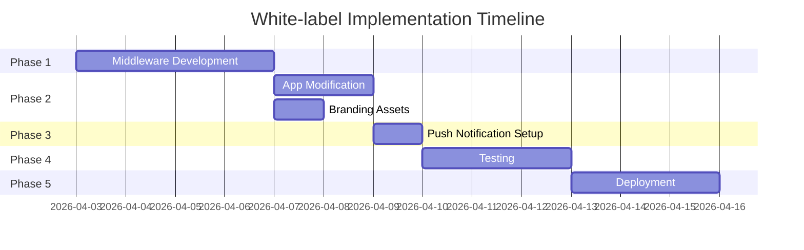
```mermaid
gantt
    title White-label Implementation Timeline
    dateFormat  YYYY-MM-DD
    section Phase 1
    Middleware Development           :p1, 2026-04-03, 4d
    section Phase 2
    App Modification                 :p2, after p1, 2d
    Branding Assets                  :p3, after p1, 1d
    section Phase 3
    Push Notification Setup          :p4, after p2, 1d
    section Phase 4
    Testing                          :p5, after p4, 3d
    section Phase 5
    Deployment                       :p6, after p5, 3d
```

---

## 🚨 CRITICAL SUCCESS FACTORS

### Must-Have for Success:

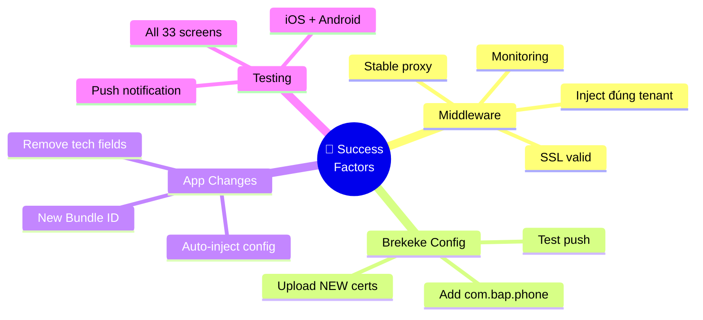
```mermaid
mindmap
  root((🎯 Success<br/>Factors))
    Middleware
      Inject đúng tenant
      Stable proxy
      SSL valid
      Monitoring
    Brekeke Config
      Add com.bap.phone
      Upload NEW certs
      Test push
    App Changes
      Remove tech fields
      Auto-inject config
      New Bundle ID
    Testing
      All 33 screens
      iOS + Android
      Push notification
```

1. **🔴 Middleware PHẢI inject đúng tenant** - Sai tenant = auth fail
2. **🔴 Brekeke admin PHẢI config app ID mới** - Không config = push fail
3. **🔴 Certificate PHẢI match Bundle ID** - Mismatch = push fail
4. **🔴 WebSocket proxy PHẢI stable** - Middleware down = app không hoạt động
5. **🔴 SSL certificate PHẢI valid** - iOS yêu cầu HTTPS/WSS

---

## ⚠️ RISKS & MITIGATION

| Risk | Impact | Mitigation |
|------|--------|------------|
| Middleware single point of failure | High | PM2 auto-restart, monitoring, health check |
| Brekeke push config complexity | Medium | Contact Brekeke support, document with screenshots |
| App Store rejection | Medium | Follow guidelines, test thoroughly |
| Tenant injection fail | High | Unit test, integration test, detailed logging |

---

## 📞 QUESTIONS FOR CUSTOMER

### Before Implementation:

1. **Domain cho middleware?** (e.g., `api.bap.com`)
2. **SSL certificate có sẵn chưa?**
3. **Brekeke server info:**
   - Hostname/IP?
   - Port? (default: 5060)
   - Tenant value?
4. **Test account để test?**
5. **Logo assets (PNG/SVG high-res)?**
6. **Deployment hosting?** (AWS, DigitalOcean, VPS?)
7. **Access to Brekeke admin panel?**
8. **Apple Developer account owner?**
9. **Google Play Console owner?**

---

## 📝 NOTES

### Những gì KHÔNG thay đổi:
- ✅ Brekeke server license
- ✅ PAL/SIP protocol
- ✅ App features
- ✅ Database/storage

### Những gì THAY ĐỔI:
- ⚠️ App UI - Simplified login
- ⚠️ Connection flow - Via middleware
- ⚠️ Bundle ID - New app identity
- ⚠️ Push config - New certificates
- ⚠️ Branding - Company logo & colors

---

**Document Version:** 2.0  
**Last Updated:** April 2, 2026  
**Prepared by:** OpenCode Assistant

---

## 🎯 NEXT STEPS

1. **Review with stakeholders**
2. **Gather required information**
3. **Approve timeline & budget**
4. **Start Phase 1: Middleware Development**

---

*For questions or clarifications, contact the development team.*
