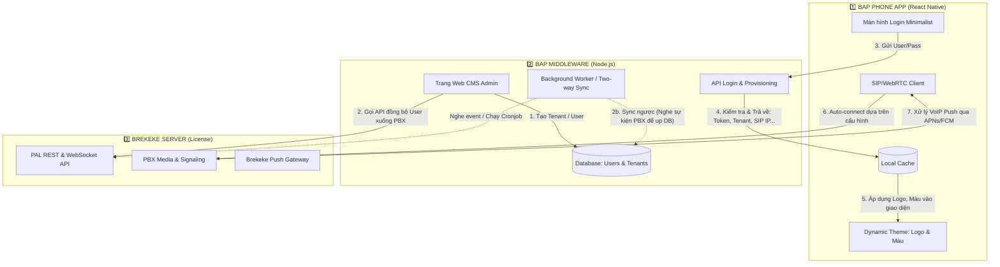

# BAP White-Label: Implementation Tasks

Tài liệu này tổng hợp danh sách các công việc (Task Checklist) cần thực hiện cho mô hình "White-Label B2B" (Auto-provisioning & Direct PBX Connection).

## 📊 STRUCTURE FLOW (AUTO-PROVISIONING MODEL)

---

## 📋 THỰC THI CHI TIẾT CÁC HẠNG MỤC

### 📱 1. BAP PHONE APP (React Native / Frontend)
*Mục tiêu: App đóng vai trò "Vỏ Bọc" giao diện, nhận và nạp tự động các cấu hình mạng do Backend cấp.*

*   **[ UI & UX ] Màn hình Đăng nhập:**
    *   Tái cấu trúc UI: Loại bỏ hoàn toàn các trường `Hostname`, `Port`, `Tenant` ra khỏi giao diện.
    *   Chỉ bảo lưu 2 trường cơ bản: `Username` (ID) và `Password`.
*   **[ Logic ] Auto-Provisioning (Cấp phát động):**
    *   Sửa đổi hàm Login: Gọi API RESTful `POST /auth/login` lên BAP Middleware (thay vì gọi thẳng PAL Login).
    *   Lưu Response (chứa `pbx_ip`, `pbx_port`, `tenant_id`, `logoUrl`, `themeColor`) vào `AsyncStorage` / MobX Store.
    *   Hỗ trợ tự động tiêm (inject) các thông số cấu hình mạng này vào hàm khởi tạo thư viện SIP/React-Native-WebRTC.
*   **[ Branding ] Dynamic Theme:**
    *   Viết logic tự động fetch Logo từ Local Storage. Nếu có thì tải trực tiếp, không thì lấy API từ link `logoUrl` đưa lên Header/Drawer.
    *   Sử dụng MobX kết hợp Styled-components để đổi toàn bộ mã màu UI (`primaryColor`, `actionColor`) theo mã màu của Tenant.
*   **[ Calling ] SIP/WebRTC Core:**
    *   Sau khi init được thư viện chuẩn, đảm bảo App nối thẳng được tới WebSocket `/phone` của con Brekeke đích theo cấu hình.
*   **[ PushKit / APNs ] Push Notifications:**
    *   Tích hợp PushKit/CallKit của iOS & NotificationService của Android.
    *   Lấy App Device Token (`com.bap.phone`) và chèn vào gói Header `pn-tok` khi SIP `REGISTER` lên Brekeke PBX.

### 🔀 2. BAP SERVER & MIDDLEWARE (Node.js Backend)
*Mục tiêu: Đóng vai trò là cuốn "Từ điển cấu hình" phân luồng người dùng và là "Website Quản trị" tập trung.*

*   **[ Storage ] Cấu trúc Database:**
    *   Table `Tenants`: Tên cty, config logo (`logo_url`), metadata màu sắc, IP của cụm PBX tương ứng.
    *   Table `Users`: Username, hashed_pw, tenant_id_mapping.
*   **[ CMS ] Admin Dashboard (Frontend Web & Backend API):**
    *   Giao diện Super-Admin thêm bớt Tenant (hỗ trợ upload Asset logo lên S3/minIO để trả URL cdn).
    *   Giao diện Tenant-Admin thêm bớt nhân sự. Cần có chức năng Batch Import (CSV).
    *   Viết Service tích hợp: Call API dạng `REST /pbx/api/users` của Brekeke để mỗi khi bấm Nút Tạo ở Admin, user trên PBX cũng được nặn ra tương tự.
*   **[ Service ] Authentication API API (`/api/login`):**
    *   Xác thực thông tin User/Password với Database nội bộ.
    *   Tra ngược Tenant mà user này quy thuộc. Lấy tất tần tật thông số (URL Brekeke, Port, logo, màu) gói chung vào một JSON Response trả về cho App.
*   **[ Operation ] Background Sync Worker (Two-way Database Sync):**
    *   Code Cronjob/Timer (vd: chạy 5 phút/lần). Dùng HTTP Call lên PAL REST API `users/list` của Brekeke quét toàn bộ User.
    *   Mapping so lại với DB của Backend -> Insert/Update nếu Brekeke có thêm mới -> Update/Disable nếu Admin Brekeke xóa thẳng user.
    *   (Nâng cao) Có thể dùng PAL WebSocket Subscribe event thay vì Cronjob.

### ☎️ 3. BREKEKE SERVER (Setup & Configuration)
*Mục tiêu: Đảm bảo nền móng vận hành kỹ thuật thoại, Security IP, Push.*

*   **[ Security ] Mở khóa IP cho Middleware:**
    *   Vào mục thiết lập `System` -> `Security`.
    *   Cho phép dải IP tĩnh của con Server BAP Middleware được truy cập API cấp quyền (Thêm vào dạng `Valid WebSocket Client IP Pattern` hoặc `API Access Whitelist`).
*   **[ Feature ] Push Notification Settings:**
    *   Đăng ký App ID `com.bap.phone` trên Apple Dev. Tải cert gốc `.p8` và Firebase Cloud Messaging (`Server key`).
    *   Import các cấu hình này vào cửa sổ `Push Notifications` trong giao diện Brekeke Admintool.
*   **[ Routing ] Dial Plan (Thiết lập quy luật gọi):**
    *   Cấu hình Routing Rule cứng trên Brekeke chặn các luồng giao tiếp chéo nhằm đảm bảo User của Tenant A không gọi được User Tenant B.
    *   Các quy định CallerID/Prefix định tuyến nếu cần ra ngoài (Trunk).
*   **[ Network ] STUN / TURN:**
    *   Thiết lập NAT rules nếu PBX không có Static Public IP tốt hoặc cần bypass firewall (Xài Google STUN Servers).
